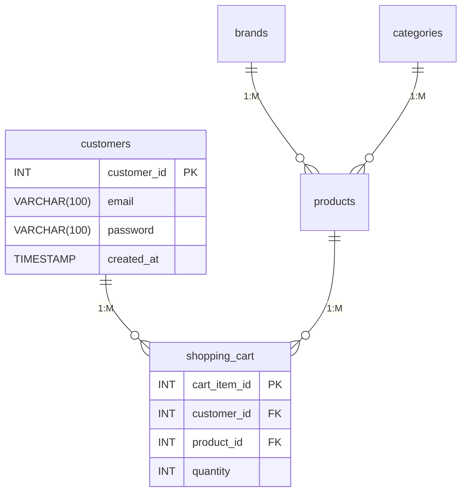
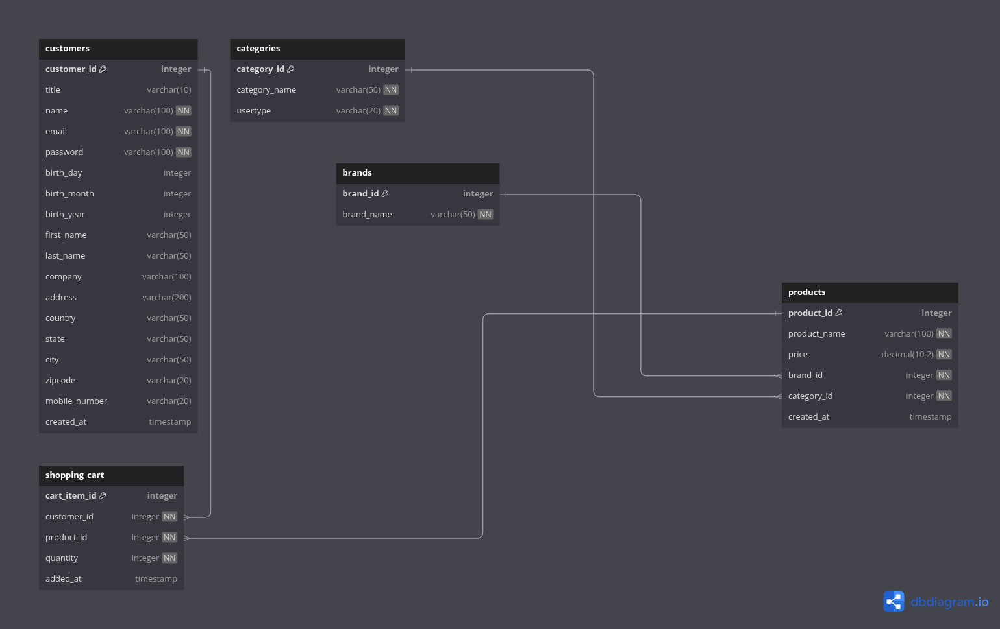

# Automation Exercises Database Documentation

## Overview
E-commerce database for managing products, customers, brands, categories, and shopping carts.

**Key Features**:
- User account management
- Product catalog with brands/categories
- Shopping cart functionality
- Data integrity constraints
- Cascade delete operations

## Schema Documentation

### Table Structure

#### customers
| Column | Type | Constraints | Description |
|--------|------|-------------|-------------|
| customer_id | INT | PRIMARY KEY, AUTO_INCREMENT | Unique user identifier |
| email | VARCHAR(100) | UNIQUE, NOT NULL | User's email address |
| password | VARCHAR(100) | NOT NULL | Hashed password |
| mobile_number | VARCHAR(20) | | Contact number |
| created_at | TIMESTAMP | DEFAULT CURRENT_TIMESTAMP | Account creation timestamp |

#### products
| Column | Type | Constraints | Description |
|--------|------|-------------|-------------|
| product_id | INT | PRIMARY KEY | Unique product identifier |
| price | DECIMAL(10,2) | NOT NULL | Product price |
| brand_id | INT | FOREIGN KEY | Reference to brands table |
| category_id | INT | FOREIGN KEY | Reference to categories table |

#### shopping_cart
| Column | Type | Constraints | Description |
|--------|------|-------------|-------------|
| cart_item_id | INT | PRIMARY KEY, AUTO_INCREMENT | Cart entry identifier |
| quantity | INT | CHECK (quantity > 0) | Minimum 1 item required |
| added_at | TIMESTAMP | DEFAULT CURRENT_TIMESTAMP | Cart update timestamp |

#### brands
| Column | Type | Constraints | Description |
|--------|------|-------------|-------------|
| brand_id | INT | PRIMARY KEY, AUTO_INCREMENT | Brand identifier |
| brand_name | VARCHAR(50) | NOT NULL | Brand display name |

#### categories
| Column | Type | Constraints | Description |
|--------|------|-------------|-------------|
| category_id | INT | PRIMARY KEY, AUTO_INCREMENT | Category identifier |
| usertype | VARCHAR(20) | NOT NULL | Target demographic |

## Relationships


## Sample Queries

### Create New Customer
```sql
INSERT INTO customers (name, email, password, country)
VALUES ('John Smith', 'john@example.com', 'secure123', 'United States');
```

### Add to Cart
```sql
INSERT INTO shopping_cart (customer_id, product_id, quantity)
VALUES (1, 5, 2)
ON DUPLICATE KEY UPDATE quantity = quantity + 2;
```

### Get Cart Contents
```sql
SELECT p.product_name, sc.quantity, (p.price * sc.quantity) AS total
FROM shopping_cart sc
JOIN products p ON sc.product_id = p.product_id
WHERE customer_id = 1;
```

## Constraints
| Constraint Type | Tables Affected | Description |
|-----------------|-----------------|-------------|
| UNIQUE | customers(email) | Prevent duplicate emails |
| FOREIGN KEY | shopping_cart(customer_id) | Enforce valid customer IDs |
| CHECK | shopping_cart(quantity) | Prevent zero/negative quantities |
| CASCADE DELETE | shopping_cart | Auto-clear cart on user/product deletion |

## Appendix

### Data Dictionary
Available in `Automation_Exercises_Database.sql`

### ER Diagram


### Conventions
- All monetary values in DECIMAL(10,2)
- Timestamps in UTC
- VARCHAR lengths optimized for expected data
